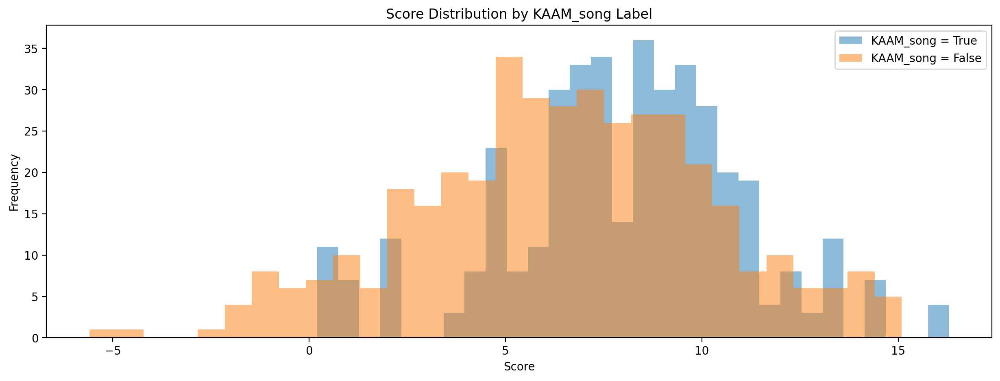

# **Experiment Details**
## Experiment 1
- First attempt at using ResNet18 to model KAAM_song.  
- Trained/validated on a split of a set of half of the focal recordings, or simply the file combined_output_macaulay_v1.csv.  
- Meant to be solely a trial run, little to no value in this model.  
## Experiment 2
- Similar to Experiment 1  
- Training and validation data consists of the full focal set of macaulay and xenocanto.  
    - Data was read from combined_output_macaulay_v2.csv and combined_output_xeno_canto.csv into one dataframe, then further divided into training and validation split.  
- The model had relatively poor performance, even though no field data had been utilized.  
## Experiment 3  
- First time utilizing field data, from Sam's AKEK field data that had multiple occurences of KAAM.  
- Training and validation set was comprised of the full focal set from experiment 2, and the field data from Sam.  
    - Similar to experiment 2, all of the data was read into a dataframe, then further divided into a training and validation split.  
- Both training and validation mAP were lower than expected, but that can be attributed to the large amount of negatives in the data.  
- **IMPORTANT NOTE:** All of the negative space from Sam's recordings were incorporated into the training/validation set. This caused there to be around 55000 negatives, and only around 900 positives.  
- Not great performance, and the model took forever to train.  
## Experiment 4  
- Same data from Experiment 3, but a much different split  
- Training data was focal recordings, validation data was sam's field data.  
- Poor performance, potentially from no overlays/augmentation being used on training data?  
- Future directions include starting active learning loop on shallow classifier predictions of test set of other field data.
## Experiment 4a
- Same exact training/validation split from experiment 4, but with resampling on both training/validation to have equal Positives/Negatives.
- Highly similar performance, but with higher mAP on the validation set. This can be attributed to class balance.  

*In the future we should only resample the training set*
- Also, first analysis of histograms in this experiment.
